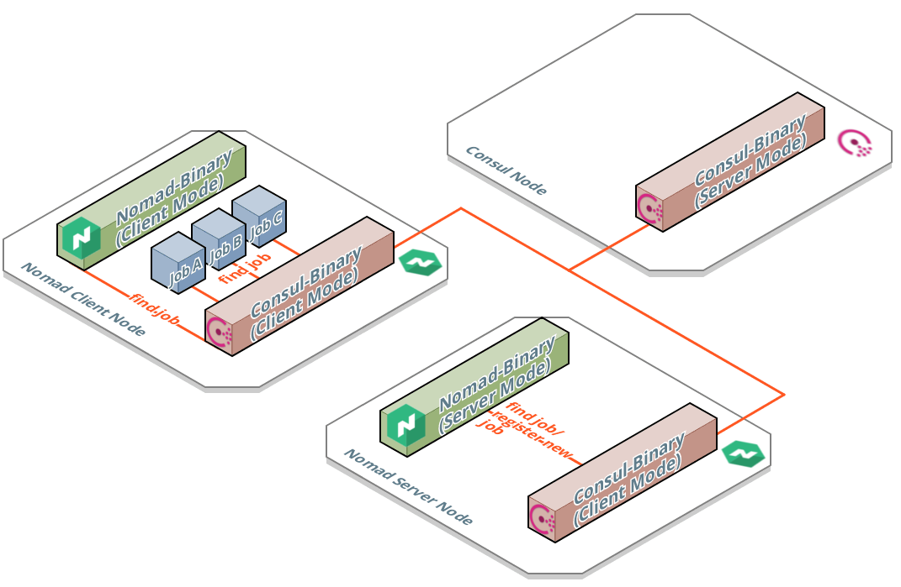
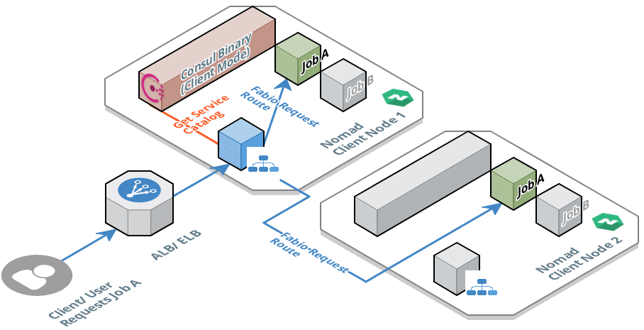

# How a production ready Container Orchestration System could look like

If you jumped on the container train and dockerized (or rockitized) your application components (microservices) you are on a good way for a scalable and resilient system.

To really run such a system on production at scale the questions to be answered are:

1. Scheduling - Where do these containers run?
2. Management - Who manages their life cycle?
3. Service Discovery - How do they find each other?
4. Load Balancing - How to route requests?

After some research one quickly finds systems like [kubernetes](https://kubernetes.io), [DC/OS](https://dcos.io), [AWS ECS](https://docs.aws.amazon.com/AmazonECS/latest/developerguide/Welcome.html), [AWS EKS](https://aws.amazon.com/eks/) (managed kubernetes cluster), [Docker Swarm](https://github.com/docker/swarm/), etc. Such systems are kind of orchestrating the containers placement, communication and life cycle. The so called **Container Orchestration Systems** are responsible to manage containers and to abstract away the actual location they are running on.

All of them have their advantages, disadvantages and of course a different feature set. For example DC/OS has really a big feature set but it is very hard to set up a production ready DC/OS cluster. Using kubernetes on Google Cloud is a good idea but as soon as you want to spin it up in an AWS environment you will have a hard time.
These problems have vanished with AWS EKS. But since this service is relatively new, important features are missing. Additionally, and even more important, with AWS EKS you loose the option to run a hybrid multi IaaS provider platform. With the abstraction you gained by using containers there is lot of potential in offloading components on cheaper platforms like [Microsoft Azure](https://azure.microsoft.com/en-us/) or even regional data-centers. Thus looking at the costs it is a good idea to keep this option.

## Nomad as Core Component

After looking at the mentioned Container Orchestration Systems there is one not to forget - it is named [Nomad](https://www.nomadproject.io). **Nomad is a scheduler of applications and services** nothing more, nothing less. Nomad can't compete with the feature set provided by kubernetes or DC/OS. But all the important features for managing and running services are available. It does "just" one job but does it very well.
Other features like service discovery, load-balancing, secret management, monitoring and logging are available open source and can be added easily.

Nomad is developed by [Hashicorp](https://www.hashicorp.com), a company focusing on Cloud Infrastructure Automation. Having the big picture in mind the hashicorp developers exactly know what are the important things and how these can be implemented in powerful components and tools. Beside nomad they provide [Consul](https://www.consul.io) (for service discovery and connectivity), [Vault](https://www.hashicorp.com/products/vault/) (for secret management) and [terraform](https://www.terraform.io) (a tool for provisioning infrastructure). All of them integrate very well with nomad, adding some of the missing features, like service discovery to the Container Orchestration System to be set up.

To summarize - the most useful features that lead to the decision for nomad are:

- Complexity - Nomad is easy to understand and thus to set up and maintain.
- Good Job - Nomad is a highly scalable and fast scheduler using an optimistic approach.
- Container Support - Docker, rocket, simple binaries/ executables can be scheduled.
- Cloud Provider Agnostic - Hybrid, multi IaaS provider cloud is possible.
- Extensibility - Very good integration in hashicorp tools. Thus the missing core features can be added in a easy and natural way.
- Deployment - Support for known deployment patterns, like rolling, canary and blue green.

## Architectural Overview

The core of the system is Nomad. Nomad is able to deploy and manage services/ applications on a fleet of compute instances (client nodes).
Actually nomad manages so called nomad jobs. A **nomad job** is either a single task or a group of tasks. A task is either a container (docker or rocket), a raw binary executable, a jar file or even a bash script. Such a job represents all the things that have to be deployed tightly together on the same client node. Usually a nomad job contains only one task.

Nomad itself is shipped as a simple binary that provides a server- and a client mode. This binary is just deployed on compute instances (i.e AWS EC2) thus transforming these instances to nomad server- or nomad client nodes.
Three instances with the nomad binary in **server mode** per data center are used to implement a fault tolerant nomad cluster across multiple availability zones. In the image above they are marked with the green nomad logo. Using the raft protocol the server nodes elect the nomad leader. The nomad leader then is responsible to manage all cluster calls and decisions.

Instances with the nomad binary in **client mode**, ares the nodes where the actual nomad jobs are deployed and running on. In the image above these nodes are indicated by the small boxes.

Nomad also provides a feature called **federation**. This enables the option to connect different nomad clusters. Having this implemented the system can orchestrate and manage services across multiple data centers, which even can be hosted by different cloud providers. Indicated by the bold purple line in the overview image, the nomad leader of data-center A communicates with the leader in data-center B using the serf (gossip) protocol.

## Service Discovery

Beside nomad, consul is also an essential part of the system and gives the answer to two important questions:

1. How do the nomad server nodes find each other and how do they know about the state and location of the nomad client nodes?
2. How do the services can find other services they have to communicate with?

The problem of service discovery is solved by consul. Consul knows the current health status and the location (IP and port) of all registered services.

Like nomad, consul is a single binary that can be run in server- or client mode. The **consul in server mode** is deployed on instances which are then transformed into the consul server nodes. In the architectural overview image these nodes are marked with the purple consul icon. For fault tolerance at least three consul server nodes are deployed. They elect (like nomad does) a leader, that manages all cluster calls and decisions.

**Consul in client mode** runs on the remaining instances, which are the nomad server- and nomad client nodes. Instead of contacting the consul server, each component directly communicates with the consul client that is locally available on each node. This removes the need to find out the actual location of the consul server.

Nomad and consul are perfectly integrated. The nomad nodes are able to find each other automatically using consul. Each node, either server or client, registers itself at consul and reports it's health status and are promoted through the consul API as available nomad-client/ nomad service.

The same feature is applied for the jobs managed by nomad. Nomad automatically registers a deployed job at consul. Thus all deployed services can be found querying the consul API, which then returns the concrete IP, port and health status of the specific service.
This implies that each service has to implement code that queries the consul API. To avoid this effort there are components we can use instead, like the load balancer [fabio](https://fabiolb.net) or [envoy](https://www.envoyproxy.io) which creates a service mesh.
To ease up the first setup fabio is used. Envoy will be introduced instead in an upcoming blog-post since as a better solution for this purpose.

## Ingress Controller

As already mentioned, fabio is used as load balancer and ingress traffic controller. Fabio integrates very well with consul, implementing the consul API. Internally fabio knows the consul service catalog and thus about the state and location of the services registered at consul. Based on this knowledge fabio adjusts ip-rules and routing tables on the specific nomad client node. Thus the requests are routed to the correct targets. It even works if the requested job lives on another instance, since the routes are based on ip and port.
This situation is shown in the image above. Here the client requests a service represented on nomad by job A. After hitting the AWS ALB the request is routed to fabio, deployed as nomad job, which then forwards the request to job A. Either to the instance of job A on nomad client node 1 or 2.

## Summary and Outlook

In this post I explained why nomad was chosen as core component of this cluster orchestration system.
I showed how the architecture of such a system could look like and discussed the components covering the most important topics like job scheduling, service discovery and load balancing/ routing of ingress traffic.

In the next post I will show how to set up the Container Orchestration System as it is described here. The whole setup is made using terraform on an empty AWS account to ensure that it can be automated/ reproduced and thus maintained easily. The goal is to have complete platform where services can be deployed and managed easily.
