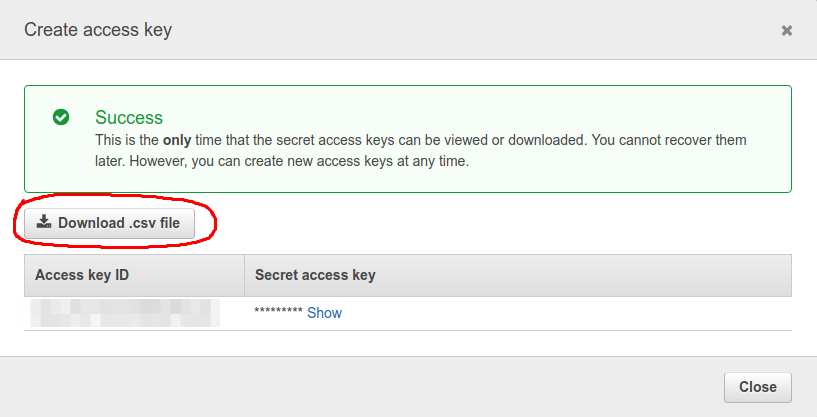
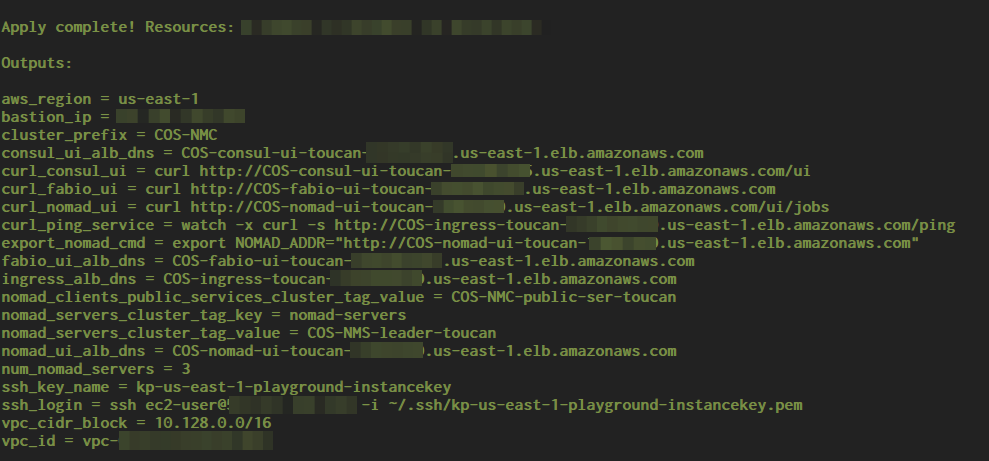
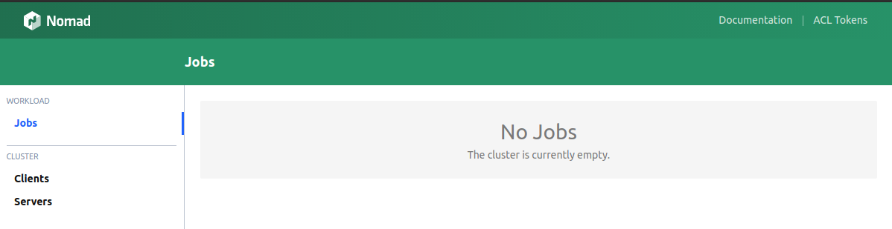
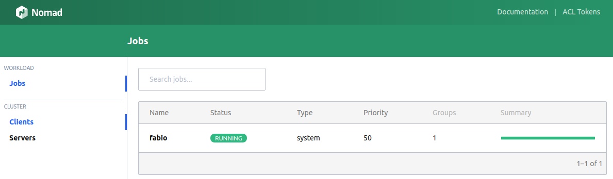
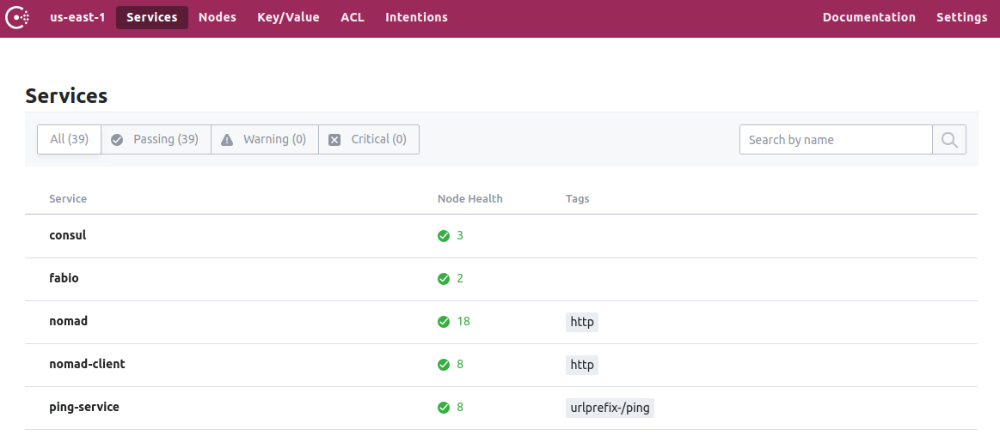

# How to set up a Container Orchestration System (COS)

In my previous post [How a Container Orchestration System could look like](https://link.medium.com/cRyTWm2N2S), I showed an architectural overview and discussed the most important components of such a system. It is based on [Nomad](https://www.nomadproject.io) as job scheduler, [Consul](https://www.consul.io) for service discovery and [fabio](https://fabiolb.net) for request routing and load balancing.

In this post I will describe step by step how to set up this COS on an empty AWS account using [terraform](https://www.terraform.io).

_All steps described and scripts used in this post are tested with an ubuntu 16.04, but should also work on other linux based systems._


## Prerequisites

Before you can start with the rollout of the COS you have to prepare, by creating an AWS account and install the tools needed for the job.

### AWS Account and Credentials Profile

The COS code is written in terraform using AWS services. Thus you need an AWS account to be able to deploy this system.
To create a new account you just have to follow the tutorial [Create and Activate an AWS Account](https://aws.amazon.com/premiumsupport/knowledge-center/create-and-activate-aws-account/).

Having an account you have to create AWS access keys using the AWS Web console:

1. Login into your new AWS account.
2. Create a new user for your account, by following this [tutorial](https://docs.aws.amazon.com/IAM/latest/UserGuide/id_users_create.html).
3. Create a new access key for this user, by following this [tutorial](https://docs.aws.amazon.com/IAM/latest/UserGuide/id_credentials_access-keys.html#Using_CreateAccessKey).

When completing this steps, don't forget to actually download the keys. This is the only time you can do this. If you loose your keys you have to create a new one following the same steps.



The downloaded file `accessKeys.csv` contains the `Access key ID` and the `Secret access key`.

Now having the key we can create an AWS profile. Such a profile is just a name referencing access keys and some options for the AWS account to be used. Therefore you have to create or edit the file `~/.aws/credentials`.
In this file you just add a new section named `my_cos_account` pasting in the `Access key ID`, the `Secret access key` and save the file.

```bash
[my_cos_account]
aws_access_key_id = PASTE HERE YOUR ACCESS KEY
aws_secret_access_key = PASTE HERE YOUR SECRET KEY
```

Now a profile named `my_cos_account` is available and will be used to directly create the AWS resources that are needed to set up the COS.

### Tools

Before you can really start to deploy the COS you have to install some essential tools.

1. **Terraform**: Is needed to create AWS resources. Here **version 0.11.11** is used.

   - Download the binary from [Terraform Downloads](https://www.terraform.io/downloads.html).
   - Unzip and install it.

   ```bash
   cd ~/Downloads
   unzip terraform_0.11.11_linux_amd64.zip
   sudo mkdir -p /opt/terraform/0.11.11
   sudo mv terraform /opt/terraform/0.11.11
   cd /usr/bin
   sudo ln -s /opt/terraform/0.11.11/terraform terraform
   ```

   - Test it with `terraform --version`

2. **Nomad (CLI)**: Is needed as CLI to be able to deploy services to the COS and show the status of the COS. Here **version 0.8.6** is used.

   - Download the binary from [Nomad Downloads](https://www.nomadproject.io/downloads.html)
   - Unzip and install it.

   ```bash
   cd ~/Downloads
   unzip nomad_0.8.6_linux_amd64.zip
   sudo mkdir -p /opt/nomad/0.8.6
   sudo mv nomad /opt/nomad/0.8.6
   cd /usr/bin
   sudo ln -s /opt/nomad/0.8.6/nomad nomad
   ```

- Test it with `nomad --version`

3. **Packer**: Is needed to bake (create) the AWS AMI that contains the nomad binary and is then actually used as image for the AWS EC2 instances that form the COS. Here **version 1.3.3** is used.

   - Download the binary from [Packer Downloads](https://www.packer.io/downloads.html)
   - Unzip and install it.

   ```bash
   cd ~/Downloads
   unzip packer_1.3.3_linux_amd64.zip
   sudo mkdir -p /opt/packer/1.3.3
   sudo mv packer /opt/packer/1.3.3
   cd /usr/bin
   sudo ln -s /opt/packer/1.3.3/packer packer
   ```

- Test it with `packer --version`

## Deployment

The whole setup consists of terraform code and is available at https://github.com/MatthiasScholz/cos.
This project is designed as a terraform module with a tailored API. It can be directly integrated into an existing infrastructure adding there a Container Orchestration System.
Additionally this project provides a self contained `root-example`, that deploys beside the COS, also a minimal networking infrastructure. This example will be used here to roll out the system.

Therefore the following steps have to be done:

1. Obtain the source code from github.
2. Build the Machine Image (AMI) for the EC2 instances.
3. Create an EC2 instance key pair.
4. Deploy the infrastructure and the COS.
5. Deploy fabio.
6. Deploy a sample service.

### Obtain the code

```bash
# Create work folder
mkdir ~/medium-cos/ && cd ~/medium-cos/

# Clone the code using tag v0.0.3
git clone --branch v0.0.3 https://github.com/MatthiasScholz/cos
```

### Build the Machine Image

In the end, there has to be on some instances a server version and on some a client version of consul and nomad. The good thing here is, that both, consul and nomad are shipped as a binary which supports the client- and the server mode. They just have to be called with different parameters.
This leads to the nice situation that just one machine image has to baked. This image contains the nomad and the consul binary.

With this one AMI:

- Instances, having consul running in server mode and no nomad running, can be launched. These are representing the consul server nodes.
- Instances, having consul running in client mode and nomad running in server mode, can be launched. These are representing the nomad server nodes.
- Instances, having consul running in client mode and nomad running in client mode, can be launched. These are representing the nomad client nodes.

To build this AMI, first packer has to be supplied with the correct AWS credentials. As described at [Authentication Packer](https://www.packer.io/docs/builders/amazon.html#authentication) you can use static, environment variables or shared credentials.
These can be set in a shell by simply exporting the following parameters.

```bash
# environment variables
export AWS_ACCESS_KEY_ID=<your access key id>
export AWS_SECRET_ACCESS_KEY=<your secret key>
export AWS_DEFAULT_REGION=us-east-1
```

To build the AMI you just call:

```bash
cd ~/medium-cos/cos/modules/ami2
# build the
packer build -var 'aws_region=us-east-1' -var 'ami_regions=us-east-1' nomad-consul-docker.json
```

As a result you will get the id of the created AMI.

```bash
==> amazon-linux-ami2: Deleting temporary keypair...
Build 'amazon-linux-ami2' finished.

==> Builds finished. The artifacts of successful builds are:
--> amazon-linux-ami2: AMIs were created:
us-east-1: ami-1234567890xyz
```

### Create an EC2 instance key pair

All instances of the COS can be accessed via ssh. Therefore during deployment an AWS instance key pair is needed.
The key to be created has to have the name `kp-us-east-1-playground-instancekey`. The key is referenced during deployment using exactly this name.

How to create a key pair is described at [Creating a Key Pair Using Amazon EC2](https://docs.aws.amazon.com/AWSEC2/latest/UserGuide/ec2-key-pairs.html#having-ec2-create-your-key-pair).

### Deploy the COS

For the deployment the `examples/root-example` will be used. It is self contained and builds not only the COS itself, but also the underlying networking infrastructure.

In this step you need the id of the AMI that was previously created and the name of your AWS profile. In our example the AMI id is `ami-1234567890xyz` and the profile is named `my_cos_account`.

```bash
cd ~/medium-cos/cos/examples/root-example
# Init terraform, download pugins and modules
terraform init

# generic terraform plan call
# terraform plan -out cos.plan -var deploy_profile=<your profile name> -var nomad_ami_id_servers=<your ami-id> -var nomad_ami_id_clients=<your ami-id>
terraform plan -out cos.plan -var deploy_profile=my_cos_account -var nomad_ami_id_servers=ami-1234567890xyz -var nomad_ami_id_clients=ami-1234567890xyz

# apply the planned changes, which means deploy the COS
terraform apply "cos.plan"
```

After successful deployment terraform prints some useful parameters to the terminal.



These can be used to open the nomad UI `xdg-open "http://$(terraform output nomad_ui_alb_dns)"` or the consul UI `xdg-open "http://$(terraform output consul_ui_alb_dns)"` in your browser.



The image above shows the web UI of the empty, but running nomad cluster.

### Deploy fabio

Now having an empty system up and running the last missing part to complete the COS setup, is fabio as the ingress traffic controller.
Fabio will be deployed as the first nomad job.

To interact with the nomad server you can make use of the nomad CLI locally installed on your computer. First you have to specify where the nomad CLI can find the nomad server by setting the environment variable `NOMAD_ADDR` appropriately.
This can be done by calling `cd ~/medium-cos/cos/examples/root-example && export NOMAD_ADDR=http://$(terraform output nomad_ui_alb_dns)`.
With `nomad server members` you should now get a list of three nomad servers, one of them elected as leader.

The nomad job description for deploying fabio is located at `~/medium-cos/cos/examples/jobs/fabio.nomad`. It will roll out the raw binary of the reverse proxy, thus no docker job yet.

```bash
job "fabio" {
  datacenters = ["public-services"]

  type = "system"
  update {
    stagger = "5s"
    max_parallel = 1
  }

  group "fabio" {
    task "fabio" {
      driver = "exec"
      config {
        command = "fabio-1.5.8-go1.10-linux_amd64"
      }

      artifact {
        source = "https://github.com/eBay/fabio/releases/download/v1.5.8/fabio-1.5.8-go1.10-linux_amd64"
      }

      resources {
        cpu = 500
        memory = 128
        network {
          mbits = 1

          port "http" {
            static = 9999
          }
          port "ui" {
            static = 9998s
          }
        }
      }
    }
  }s
}
```

With `nomad run ~/medium-cos/cos/examples/jobs/fabio.nomad`, fabio will be deployed to nomad to complete the COS setup.
To test if the deployment succeed you can either open the fabio UI using `xdg-open "http://$(terraform output fabio_ui_alb_dns)"` or check the nomad UI.



In the image above, fabio running as nomad system job is shown. Thus the deployment was successful.

## Deploy a Sample Service

Also part of the [COS project](https://github.com/MatthiasScholz/cos) at github is a nomad job description for deploying a sample service, the ping-service.

The ping-service is a simple service for testing purposes. When you send a request to it's endpoint, the service tries to forward this request to other instances of the ping-service. This is done for a defined number of hops or "pings". For each hop a "ping" is added to the response. The last receiver in the chain stops forwarding and adds a "pong" to concatenated message list.

So now lets deploy the ping-service and send a request against it.
By calling `nomad run ~/medium-cos/cos/examples/jobs/ping_service.nomad` four instances of the ping-service will be deployed to the COS.
Looking at consul one can see that beside, consul, nomad, nomad-clients and fabio also the ping-service is automatically registered by nomad. Thus the four deployed ping-service instances can be found via service discovery.

Each instance of the service runs in one of the four data centers of the COS, in public-services, private-services, content-connector or backoffice data center. More details about the available data centers can be found at [COS Architecture](https://github.com/MatthiasScholz/cos/blob/master/README.md).



Side note: As you can see in the image above, the tag `urlprefix-/ping` was added for the ping-service. This tag is needed to tell fabio to which service he should route all requests that hit the endpoint `/ping`. More details about this can be found at [fabio quickstart](https://fabiolb.net/quickstart/).

To test if the ping-service was deployed correctly, if he can find the other instances using the consul catalogue API and if fabio is able to route a request to a ping-service instance, you just have to send a GET request against the `/ping` endpoint.

```bash
# Obtain DNS name of the ingress ALB
export IGRESS_ALB=http://$(terraform output ingress_alb_dns)

# Send the test request once against the ping-service running in the COS
curl $IGRESS_ALB/ping
```

As a result you get sth. like:

```bash
{
  "message": "/[private-services,v1]/[public-services,v1]/[content-connector,v1]/.../[content-connector,v1](PONG)",
  "name": "private-services",
  "version": "v1"
}
```

The field `name` denotes the data center of the ping-service instance that was hit first by the request (hop number one). In the `message` field you can see how the request propagates through the deployed instances of the service. From the private-services, to public-services, to content-connector, ..., to finally stop after 10 hops with the PONG message.

This test nicely shows that the service-discovery over consul and the request routing using fabio works as intended.

## Summary and Outlook

In this post I showed how to set up a Container Orchestration System as described at [How a Container Orchestration System could look like](https://link.medium.com/cRyTWm2N2S). I started with explaining the installation of the basic setup. Followed by building up the COS on an empty AWS account, using the terraform code available at https://github.com/MatthiasScholz/cos and deploying fabio. Finally to use the system, a first sample service was rolled out and tested.

Making use of https://github.com/MatthiasScholz/cos you can easily try it on your own. Deploy the root-example, run your services, extend the COS by adding monitoring and logging, etc. Furthermore you can use the COS terraform module and integrate it directly into your infrastructure.

In the next post I will show how a good, default nomad job description could look like in order to get a resilient system running.
