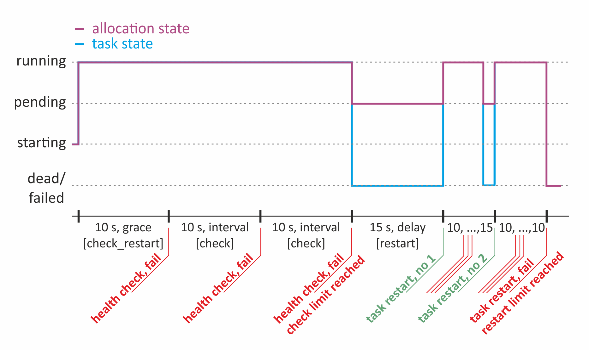
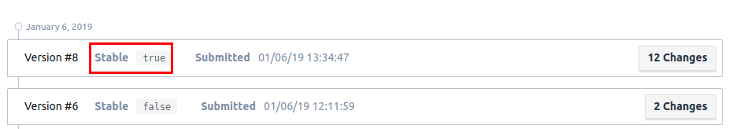

# A good Nomad Job Template

A Container Orchestration System (COS) adds application life cycle management, scheduling and placement based on available resources and connectivity features to your cloud system. It takes away the responsibility from you to take care for these tasks. Thus it is possible, instead of implementing the mentioned features in each of your services, to reduce the complexity in the components you have to develop.
Developing a cloud system the first goal is to satisfy your customers. Beside good quality of content, a responsive UI and a appealing design of the application the main goal is to have a resilient, fault tolerant and stable system. You want to get as close as possible to the 0-downtime label.

To get this, again, you can implement the needed parts in each of your components or you can take advantage of the qualities offered by the COS.
[Nomad](https://www.nomadproject.io) in particular covers three scenarios which would lead to potential downtime.
These are issues that can be mitigated or even solved using nomad:

1. Unresponsive Service - An already deployed and running version of the service gets unresponsive or unhealthy over time.
2. Dead Service - An already deployed and running version of the service gets unresponsive or unhealthy over time.
3. Dead Node - On a nomad client node something is completely broken. For example the docker daemon does not work any more.
4. Faulty Service Version - The latest commit introduces a bug that leads to instability of the service.

Of course, those four situations can be solved by an operator, who just restarts the service (1, 2), moves the service to a healthy node (3) and rolls back the service to a previously deployed version (4). But as we all know machines are better in doing repetitive tasks and are less error prone there. So lets make use of the features of the machine called nomad and automate this kind of self healing.

**In this post I want to present and discuss a nomad job definition that can be used as default template for most applications**. Of course there are parameters that have to be adjusted to your needs, but I want to line out what could be a good starting point in order to get a resilient application as described before.

## The Fail-Service

To test the resiliency features of nomad and develop the nomad job template incrementally a service whose stability can be influenced is needed. For this purpose I make use of the [Fail-Service](https://github.com/ThomasObenaus/dummy-services/tree/master/fail_service).

The fail-service is a small golang based service for testing purposes. The only feature it offers is getting healthy or unhealthy. The provided `/health` endpoint can be used to check the state. It reports 200_OK if the service is healthy or 504_GatewayTimeout otherwise.

The service state can be influenced via command line parameters or by sending a request to the `/sethealthy` or `/setunhealthy` endpoint.
Here are some examples:

```bash
# Service will stay healthy forever
./fail_service -healthy-for=-1

# Gets healthy in 10s, then after 20s it gets unhealthy. For 3s it stays unhealthy
# and gets healthy again to stay so for 20s. etc.
./fail_service -healthy-in=10 -healthy-for=20 -unhealthy-for=3

# Gets healthy in 10s, then after 20s it gets unhealthy and then stays unhealthy forever.
./fail_service -healthy-in=10 -healthy-for=20 -unhealthy-for=-1
```

To get the service it can be easily be build running `make build` and even better it can be pulled from Docker Hub via `docker pull thobe/fail_service:latest`. This makes it easy for us to use it directly in a nomad job file.

Which leads us to our first minimal nomad job file definition [minimal.nomad](https://gist.github.com/ThomasObenaus/3e46a53a9bfaabb0fad268e9900ab125).

```bash
job "fail-service" {
  datacenters = ["public-services"]

  type = "service"

  group "fail-service" {
    count = 1

    task "fail-service" {
      driver = "docker"
      config {
        image = "thobe/fail_service:v0.0.12"
        port_map = {
          http = 8080
        }
      }

      # Documentation for service stanza:
      # https://www.nomadproject.io/docs/job-specification/service.html
      service {
        name = "${TASK}"
        port = "http"
        tags = ["urlprefix-/fail-service strip=/fail-service"]
        check {
          name     = "fail_service health using http endpoint '/health'"
          port     = "http"
          type     = "http"
          path     = "/health"
          method   = "GET"
          interval = "10s"
          timeout  = "2s"
        }
      }

      env {
        HEALTHY_FOR    = -1, # Stays healthy forever
      }

      resources {
        cpu    = 100 # MHz
        memory = 256 # MB
        network {
          mbits = 10
          port "http" {}
        }
      }
    }
  }
}
```

While evolving the job file incrementally I'll just add the part that has changed regarding the previous one to keep the text in check. For each new configuration part the link to the official documentation is added inline.
In order to monitor the state of the service, nomad has to know how to obtain this information. This is specified in the `job > group > task > service > check{...}` section. There nomad shall call each 10s the `/health` endpoint of the service using the HTTP protocol and should treat the state as healthy if the service has responded within 2s.
The environment variable `HEALTHY_FOR` defined in `job > group > task > service > env {...}` is set to -1, which tells the fail-service to stay healthy forever.
With `tags = ["urlprefix-/fail-service strip=/fail-service"] # fabio` we specified that fabio shall route all requests that hit `/fail-service/*` shall be routed to the fail-service and that `/fail-service` shall be removed from the path. This is needed to ensure that the request hits the fail-service with `/health` and not with `/fail-service/health`, which the service does not implement.

## Platform for Testing

For being able to actually deploy the nomad job file that is developed here, a COS as described at [How a Container Orchestration System Could Look Like](https://medium.com/@obenaus.thomas/how-a-production-ready-container-orchestration-system-could-look-like-6f92b81a3319) is needed. You either can set one up in an AWS account, following the tutorial [How to Set Up a Container Orchestration System](https://medium.com/@obenaus.thomas/how-to-set-up-a-container-orchestration-system-cos-c5805790f0c1) or you can make use of nomads dev-mode.
How to use the dev-mode is described at [COS Project, devmode](https://github.com/MatthiasScholz/cos/tree/f/script_for_devmode/examples/devmode). There you simply have to call the provided script `./devmode <host-ip-addr> public-services`. This spins up a consul and a nomad instance and provides a nomad job file for fabio deployment.

Now we simply can deploy the first version by running `nomad run minimal.nomad`. Then with `watch -x curl -s http://\<cluster-address\>:9999/fail-service/health` you get back constantly a `200_OK` and `{"message":"Ok","ok":true}`.

## Adding Resilience

Now lets assume our service behaves somehow problematic - it gets unhealthy after 30s. This can be simulated by replacing the environment variable definition

```bash
env { HEALTHY_FOR    = -1 }
```

with

```bash
env {
  UNHEALTHY_FOR = -1,
  HEALTHY_FOR   = 30,
}
```

in the first job file and save it as [minimal_unhealthy.nomad](https://gist.github.com/ThomasObenaus/d126921005691e9a79201e225fdc6bf1). With the deployment of this new version (`nomad run minimal_unhealthy.nomad`) you can see how the curl call stops returning messages. The reason for this is that fabio won't route any traffic to services that are unhealthy in the consul service catalog. This bad situation now will last forever since no one is here to stop or restart the faulty service.
Here nomad offers restart and rescheduling features. [Building Resilient Infrastructure with Nomad: Restarting tasks](https://www.hashicorp.com/blog/resilient-infrastructure-with-nomad-restarting-tasks) gives a nice explanation how failed or unresponsive jobs can be automatically restarted or even rescheduled on other nodes.

### Restart failed/ unresponsive Jobs

With the `job > group > task > service > check{...}` section, as part of the [service stanza](https://www.nomadproject.io/docs/job-specification/service.html)), nomad already knows how check the service health state. By adding the [check_restart stanza](https://www.nomadproject.io/docs/job-specification/check_restart.html) to the service definition, nomad knows when to kill a unresponsive service - how many failed health checks are enough to treat a service as unresponsive and "ready to be killed".
Then with the addition of the [restart stanza](https://www.nomadproject.io/docs/job-specification/restart.html) to the group definition you can control when and how nomad shall restart a killed service. This restart policy applies to services killed by nomad due to be unresponsive or exceeding memory limits and to those who just crashed.

The adjusted nomad job file [check_restart_unhealthy.nomad](https://gist.github.com/ThomasObenaus/9807504567b12411aa529d409c686883) now looks like and can be deployed via `nomad run check_restart_unhealthy.nomad`.

```bash
job "fail-service" {
  [..]
  group "fail-service" {
    count = 1

    # New restart stanza/ policy
    restart {
      interval = "10m"
      attempts = 2
      delay    = "15s"
      mode     = "fail"
    }
    # New restart stanza/ policy

    task "fail-service" {
      [..]
      service {
        [..]
        # New check_restart stanza
        check_restart {
          limit = 3
          grace = "10s"
          ignore_warnings = false
        }
        # New check_restart stanza
      [..]
```

With this deployment you can observe that nomad kills the unresponsive fail-service (task) and restarts the allocation several times.



This behavior is shown schematically in the image above:

1. The initial health-check is done after waiting for 10s. Specified by `check_restart { grace = "10s" }`.
2. The following health-checks are done each 10s. Specified by `check { interval = "10s" }`.
3. Nomad kills the task after 3 consecutively failed health-checks and treats it as dead. Specified by `check_restart { limit = 3 }`.
4. Then nomad restarts the dead task after a delay of 15s. Specified by `restart { delay = "15s" }`.
5. Nomad won't restart the task a third time if it already failed two consecutive times in 10 minutes. And treats the allocation as failed Specified by

   ```bash
   restart {
     attempts = 2
     interval = "10m"
   }
   ```

### Reschedule failing Jobs

With this extended nomad job file we have now a system that can heal a service that fails or gets unresponsive sometimes. But what if there is a systematic or persistent problem? For example it could be that the docker daemon on a specific node is just broken. Here nomad per default tries to reschedule failing jobs on nodes that are healthy (regarding the driver state) and prefers nodes the job did not run beforehand.
To specify the rescheduling behavior explicitly we extend the nomad job file by adding the [rescheduling stanza](https://www.nomadproject.io/docs/job-specification/reschedule.html).

```bash
job "fail-service" {
  [..]
  reschedule {
    delay = "2m"
    delay_function = "constant"
    unlimited = true
  }
  [..]
```

The parameter `delay` specifies the duration to wait before rescheduling. `delay_function` defines the function used to calculate the next value of the `delay`parameter. Here I prefer to use the `constant` function as default, since it gives more control compared to `exponential` or `fibonacci`.
Finally the parameter `unlimited = true` tells nomad to repeat the rescheduling forever. I recommend this over setting `unlimited`to `false` since with this setting the job would end up in state `dead`. If this state is reached manual effort is needed (call `nomad job stop fail-service`) to get the job back up working again. A simple redeployment is not enough - which is a bug in nomad I think. Furthermore an automatic revert to a previously working version is only supported during deployments not for already running versions that get mad after time.

The adjusted nomad job file [reschedule_unhealthy.nomad](https://gist.github.com/ThomasObenaus/4b645b3e7fd1a485b0b7c88dbf4e3db6) can be deployed via `nomad run reschedule_unhealthy.nomad`.


With this deployment you can observe that nomad reschedules the failed allocation continuously as depicted in the graphic above. If a allocation finally failed after restarting the task three times, nomad reschedules the job. Thus after 2 minutes (`delay = "2m"`) a new allocation is created and started. This rescheduling will be done forever (`unlimited = true`), while keeping the time the job is in pending state fixed at 2m (`delay_function = "constant"`).

## No Deployment of faulty Versions

With the points discussed so far, we have a job file that makes use of the nomad features to cope with the points 1 (Unresponsive Service), 2 (Dead Service) and 3 (Dead Node). As indicated, nomad is also able to help with the problem of deploying a faulty version (point 4).

Nomad provides standard deployment patterns like rolling update, canary- and blue/ green deployment. Again, for this topic as well, hashicorp has written the nice blog post [Job Lifecycle](https://www.hashicorp.com/blog/building-resilient-infrastructure-with-nomad-job-lifecycle) explaining how deployment of nomad jobs can be configured.

This post is about defining a good default nomad job file. That's why, I'll just focus on the rolling update as the default pattern. The remaining ones need manual operation, i.e. a canary has to be promoted manually when testing was successful.

The type of deployment is specified with the [update stanza](https://www.nomadproject.io/docs/job-specification/update.html). Per default no deployment pattern is used. Thus we extend the job file by:

```bash
job "fail-service" {
  [..]
  update {
    max_parallel      = 1
    health_check      = "checks"
    min_healthy_time  = "10s"
    healthy_deadline  = "5m"
    progress_deadline = "10m"
    auto_revert       = true
    canary            = 0
    stagger           = "30s"
  }
  [..]
```

Furthermore we adjust the job file to deploy three healthy instances of the fail-service to see show how a successful deployment looks like.

1. Change `count = 1` to `count = 3`.
2. Replace the current `env` section by `env { HEALTHY_FOR = -1 }`.
3. Save it as [rolling_deployment.nomad](https://gist.github.com/ThomasObenaus/3c0496534271392cf155b9d4a5a33af4).

By calling `nomad run rolling_deployment.nomad` a job with a successful rolling update can be observed at nomad.


Successfully deployed versions are marked as "stable" on nomad side. Only versions that were deployed by using the update stanza will be potentially marked as stable by nomad.



Now after having deployed a working version, we want to see how nomad behaves if a faulty or constantly unhealthy version is deployed using a rolling update. Therefore the job-file has to be adjusted a bit again.
By replacing `env { HEALTHY_FOR = -1 }` with `env { HEALTHY_IN = -1 }` we get [rolling_deployment_unhealthy.nomad](https://gist.github.com/ThomasObenaus/a6405aef948bd26fa716094dc8825125). Which can be deployed with `nomad run rolling_deployment_unhealthy.nomad`.

With the update stanza in the job file we defined a rolling update. Here nomad replaces one (`max_parallel = 1`) of the currently running version by a new one.
If an instance of the new version is healthy for at least 10s (`min_healthy_time = "10s"`) nomad will take down the next old version and tries to update it. But in our case even the first instance of the new version never gets healthy. Thus nomad follows the rules that are defined in the job file for restarting and rescheduling to get the new version up. Since we have defined an unlimited amount of rescheduling retries the deployment would take forever. To avoid this two parameters have to be considered.
The `healthy_deadline = "5m"` specifies how much time an allocation has to get healthy at max before being rescheduled. If the new version does not get healthy in within 5m the allocation will be marked as unhealthy and the rescheduling will be started. Even if there are other numbers defined in the `check` and `restart` stanza, that would have specified more time for the allocation to get healthy before being rescheduled. Furthermore even if the `healthy_deadline` has been exceeded the deployment still goes on.
The parameter `progress_deadline = "10m"` defines the time a deployment can take at maximum before being marked as failed if not all allocations get healthy in this span.


As you can see in the image above the deployment failed because the deployed version could not get healthy within the `progress_deadline`. Even if nomad was able to place and try four allocations within this time span.

Finally the parameter `auto_revert = true` introduces nomad to roll back and to deploy the latest version that was marked as stable.

## Nomad Job Template

To conclude, the last job file that was used for the rolling deployment will be transformed into the following template.

```bash
job "{{service_name}}" {
  datacenters = [{{list_of_datacenters}}]

  type = "service"

  reschedule {
    delay = "30s"
    delay_function = "constant"
    unlimited = true
  }

  update {
    max_parallel      = 1
    health_check      = "checks"
    min_healthy_time  = "10s"
    healthy_deadline  = "5m"
    progress_deadline = "10m"
    auto_revert       = true
    canary            = 0
    stagger           = "30s"
  }

  group "{{service_name}}" {
    count = {{count}}

    restart {
      interval = "10m"
      attempts = 2
      delay    = "15s"
      mode     = "fail"
    }

    task "{{service_name}}" {
      driver = "docker"
      config {
        image = "{{docker_image}}"
        port_map = {
          http = {{exposed_port_for_health_check}}
        }
      }

      service {
        name = "{{service_name}}"
        port = "http"
        tags = ["urlprefix-/{{service_name}} strip=/{{service_name}}"] # fabio
        check {
          name     = "{{service_name}} health using http endpoint '/health'"
          port     = "http"
          type     = "http"
          path     = "/health"
          method   = "GET"
          interval = "10s"
          timeout  = "2s"
        }

        check_restart {
          limit = 3
          grace = "10s"
          ignore_warnings = false
        }
      }

      resources {
        cpu    = 100 # MHz
        memory = 256 # MB
        network {
          mbits = 10
          port "http" {}
        }
      }
    }
  }
}
```

The template contains the discussed features:

- Restarting of failed/ unresponsive jobs.
- Rescheduling jobs to healthy nodes.
- Rolling deployment to avoid running faulty versions in production.

To fill it one has to specify the variable parts, which are defined using the [golang template notation](https://golang.org/pkg/text/template/).

These are:

1. `{{service_name}}` ... The name of the service, i.e. `fail-service`.
2. `{{list_of_datacenters}}` ... The nomad data centers the service shall be deployed to. This is a comma separated list of strings, i.e. `"public-services","backoffice"`.
3. `{{docker_image}}` ... The full name of the docker image that shall be pulled, including repository name and version. I.e. `thobe/fail_service:v0.0.12`.
4. `{{exposed_port_for_health_check}}` ... The port that is exposed by the service over which the `/health` endpoint can be reached. I.e. `8080`.

For easy handling in your preferred editor, you can use the according snippets:

1. Visual Studio Code
2. Atom
3. Sublime
4. Emacs
